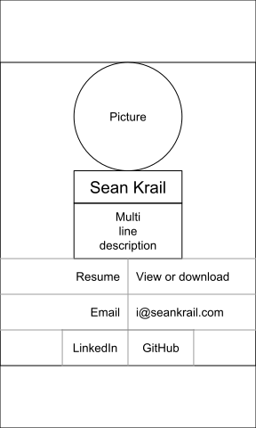
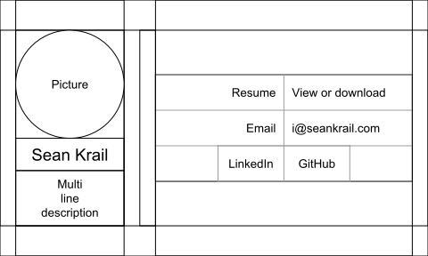
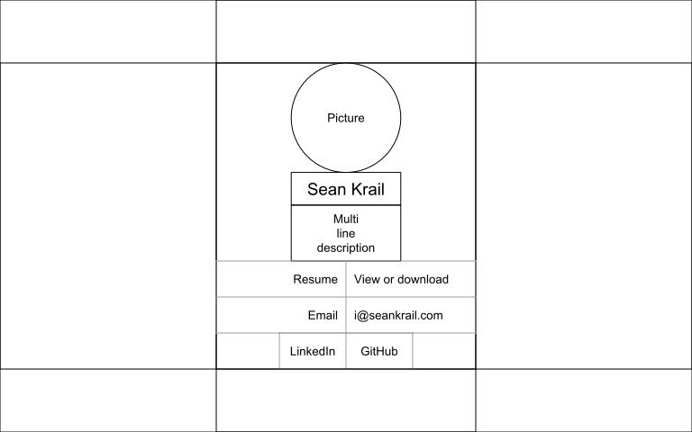

# Design
Focus is on my name, link to my resume, and my email, in that order.
Nothing should distract from these three items.
Some additional items to include are a profile picture and links to my GitHub and LinkedIn profile.

## Mobile-first
The design should be mobile-first, also known as responsive web design.
Since those viewing the page may be on there phone or laptop,
the page should render well on all different screen sizes and resolutions.
This can be achieved with CSS targeted for mobile devices
and then media queries that respond to larger viewport sizes.

## Wireframe
### Mobile
These wireframes accomplish the goal of the website with its focus on all of the key items.
The stack design works well when the screen is held in both portrait and landscape mode.

#### Portrait

#### Landscape

### Desktop

The desktop wireframe is identical to the mobile wireframe when in portrait mode,
but it's no longer locked in to the screen width and height.
It is still horizontally and vertically aligned with the screen.
